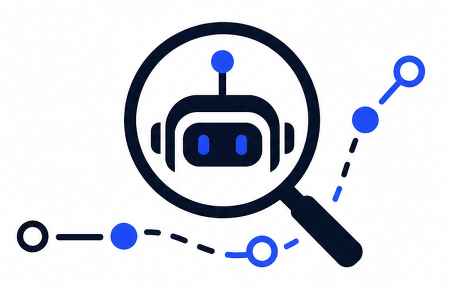
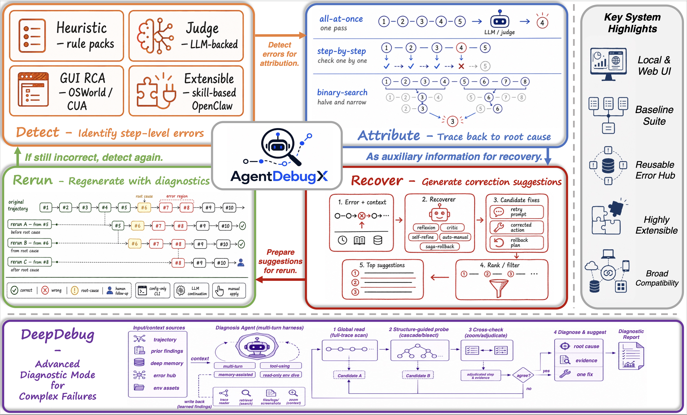

<div align="center">



# AgentDebugX

**A local-first debugging framework for agentic AI systems: diagnose failures, attribute root causes, recover with evidence, and validate fixes through reruns.**

[](https://pypi.org/project/agentdebugx/)
[](https://github.com/AgentDebugX/AgentDebugX/actions/workflows/ci.yml)
[](LICENSE)
[](pyproject.toml)

<a href="https://www.agentdebugx.com"></a>
<a href="https://github.com/AgentDebugX/AgentDebugX"></a>
<a href="https://youtu.be/ztni6w0o_l8"></a>

</div>

---

AgentDebugX turns failed agent runs into structured, auditable debugging
artifacts. It ingests a live or exported trajectory, detects visible failure
signals, attributes them to responsible steps or agents, proposes recovery
actions, and prepares controlled reruns so fixes can be validated instead of
guessed.

The project is designed for researchers and engineers building complex LLM
agents: multi-agent systems, tool-using agents, computer-use agents, benchmark
runners, and local agent development workflows. AgentDebugX is local-first by
default: traces stay on your machine, sharing is opt-in, and recovery execution
is gated by explicit policy or human approval.

## System Overview

<p align="center">
  
</p>

AgentDebugX follows the two-stage loop used by the project paper:

```text
Diagnose = Detect -> Attribute -> Recover
Rerun    = checkpoint -> retry directive -> branch execution -> evaluation
```

`Diagnose` explains what failed and why. `Rerun` tests whether the proposed
recovery actually improves the agent behavior.

## Why AgentDebugX

Tracing tools show what happened. AgentDebugX focuses on the debugging step that
usually comes next:

- Which earlier decision caused the visible failure?
- Which agent, tool call, memory read, handoff, or GUI action was responsible?
- What evidence supports that diagnosis?
- What concrete recovery should be tried?
- Did the rerun branch improve the outcome?

The output is a portable diagnostic report that can be inspected in a local UI,
used by a CLI workflow, stored in an Error Hub bundle, or invoked from an
agentic skill.

## Core Capabilities

- **Portable trace schema**: framework-agnostic trajectory, event, finding, and
  diagnostic report models.
- **Ingest adapters**: normalize raw JSON, LangGraph, CrewAI, OpenAI Agents SDK,
  OpenTelemetry, GAIA/Open Deep Research, OSWorld, and other exported traces.
- **Detect**: deterministic analyzers, manifest-backed rule packs, LLM judge
  mode, GUI-aware signals, and taxonomy induction support.
- **Attribute**: heuristic attribution, all-at-once analysis, step-by-step
  localization, binary search, counterfactual attribution, MOE localization,
  and DeepDebug.
- **Recover**: Reflexion, CRITIC, Self-Refine, AutoManual, DeepDebug recovery,
  and saga rollback style strategies.
- **Rerun**: auditable rerun plans, checkpoint selection, retry directives,
  executor protocol, branch comparison, and local proxy evaluation.
- **Local inspection UI**: no-build FastAPI dashboard for traces, reports,
  saved cases, debug branches, and rerun-from-event workflows.
- **Error Hub**: scrubbed, shareable failure bundles for regression tests,
  benchmark corpora, and team debugging memory.
- **Agent integrations**: generate host-runtime assets such as debugging skills
  for external agent tools.

## Install

```bash
pip install agentdebugx
```

Optional extras:

```bash
pip install "agentdebugx[ui]"             # local FastAPI dashboard
pip install "agentdebugx[langgraph]"      # LangGraph adapter
pip install "agentdebugx[crewai]"         # CrewAI adapter
pip install "agentdebugx[openai-agents]"  # OpenAI Agents SDK adapter
pip install "agentdebugx[otel]"           # OpenTelemetry ingest
pip install "agentdebugx[gui]"            # computer-use / OSWorld GUI tooling
pip install "agentdebugx[all]"            # all optional integrations
```

The package is installed as `agentdebugx` and imported as `agentdebug`:

```python
import agentdebug
```

## Quick Start: Python API

Record a trajectory and analyze it locally:

```python
from agentdebug import AgentDebug, EventType

debugger = AgentDebug()

with debugger.trace(
    goal="Book a refundable NYC to SFO flight",
    framework="my-agent",
) as trace:
    trace.record(
        EventType.PLAN,
        agent_name="planner",
        step_index=1,
        output="Search for the cheapest fares.",
    )
    trace.record(
        EventType.TOOL_RESULT,
        agent_name="browser",
        step_index=3,
        error="Checkout failed: refund_policy is required.",
    )

    report = trace.analyze()

print(report.summary)
for finding in report.findings:
    print(finding.failure_mode.mode_id, finding.step_index, finding.evidence)
```

The report localizes the responsible upstream step rather than only reporting
the final visible error.

## Quick Start: CLI

The CLI supports the complete Diagnose -> Rerun workflow. The web console is
optional and is not required for trace conversion, diagnosis, attribution,
recovery planning, or rerun preparation.

### 1. Normalize an external trace

AgentDebugX can auto-detect common JSON and JSONL exports:

```bash
agentdebug ingest raw_trace.json --format auto --out trace.json
```

Use `--format` when the source is known, for example `messages`,
`openai_agents_spans`, `crewai_events`, `langgraph_callbacks`, `claude_code`,
or `osworld`.

### 2. Run a fully local diagnosis

The deterministic pipeline does not require an API key:

```bash
agentdebug diagnose trace.json \
  --mode heuristic \
  --attributor heuristic \
  --recovery reflexion \
  --out report.json
```

Render the same diagnosis as a cascade-oriented traceback:

```bash
agentdebug diagnose trace.json \
  --mode heuristic \
  --attributor heuristic \
  --recovery reflexion \
  --traceback
```

### 3. Enable LLM-backed diagnosis

Save an OpenAI-compatible endpoint once:

```bash
agentdebug config set-llm \
  --base-url "https://<openai-compatible-host>/v1" \
  --api-key "<secret>" \
  --model "<model>"
```

Then select the diagnosis, attribution, and recovery implementations
explicitly:

```bash
agentdebug diagnose trace.json \
  --mode judge \
  --attributor all-at-once \
  --recovery self-refine \
  --out report.json
```

Environment variables can be used instead of saved configuration:

```bash
export AGENTDEBUG_LLM_BASE_URL="https://<openai-compatible-host>/v1"
export AGENTDEBUG_LLM_API_KEY="<secret>"
export AGENTDEBUG_LLM_MODEL="<model>"
```

Use `agentdebug config show` to inspect masked configuration and
`agentdebug config doctor` to test the configured endpoint.

### 4. Prepare the Rerun stage

Turn the diagnostic report into an auditable rerun configuration:

```bash
agentdebug rerun report.json --trajectory trace.json --out rerun.json
```

### 5. Work with stored traces

The CLI can query SQLite or JSONL stores created by instrumented runs or the
local console:

```bash
agentdebug list --store-sqlite .agentdebug/traces.sqlite
agentdebug show <trace-id> --store-sqlite .agentdebug/traces.sqlite
agentdebug diagnose <trace-id> \
  --store-sqlite .agentdebug/traces.sqlite \
  --mode heuristic \
  --attributor heuristic \
  --recovery reflexion
```

### 6. Package and integrate debugging workflows

Publish a scrubbed failure bundle to a local Error Hub:

```bash
agentdebug hub push <trace-id> \
  --store-sqlite .agentdebug/traces.sqlite \
  --to local:./agentdebug-hub
```

Generate a debugging skill for a supported host runtime:

```bash
agentdebug integrations skill --platform claude --target .claude/skills
```

### Optional: launch the local console

Install the UI extra only when a visual inspection workflow is useful:

```bash
pip install "agentdebugx[ui]"
agentdebug serve \
  --store-sqlite .agentdebug/traces.sqlite \
  --host 127.0.0.1 \
  --port 7777
```

## CLI Reference

| Command | Purpose |
| --- | --- |
| `agentdebug ingest` | Normalize an external trace export into AgentDebugX schema |
| `agentdebug diagnose` | Run detection, attribution, and recovery planning |
| `agentdebug rerun` | Build a second-stage rerun plan from a diagnostic report |
| `agentdebug list` / `agentdebug show` | Inspect traces in a local store |
| `agentdebug config` | Save, inspect, clear, and test LLM configuration |
| `agentdebug hub` | Package, scrub, push, and pull Error Hub bundles |
| `agentdebug integrations` | Generate external runtime integration assets |
| `agentdebug act` | Compatibility namespace for Hub and integration actions |
| `agentdebug serve` / `agentdebug inspect` | Launch the optional local web console |
| `agentdebug doctor` | Report optional dependency and configuration status |
| `agentdebug analyze` | Compatibility entry point for heuristic diagnosis |
| `agentdebug convert` | Compatibility alias for `agentdebug ingest` |

Run `agentdebug <command> --help` for version-specific flags.

## Architecture

The repository mirrors the paper-level workflow:

```text
src/agentdebug/schema/       portable trajectory, event, report, and taxonomy contracts
src/agentdebug/runtime/      storage, LLM clients, event bus, and plugin registry
src/agentdebug/ingest/       live capture APIs and offline trace importers
src/agentdebug/diagnose/     Detect -> Attribute -> Recover pipeline
src/agentdebug/rerun/        rerun plans, requests, branch comparison, and executors
src/agentdebug/inspect/      traceback renderer and local inspection UI
src/agentdebug/hub/          scrubbed failure bundle packaging and backends
src/agentdebug/integrations/ host skill and runtime integration generators
cua_debugger/                computer-use / OSWorld GUI root-cause tooling
examples/                    runnable examples and demo traces
docs/                        architecture, schema, and project assets
```

Detailed references:

- [Architecture](docs/ARCHITECTURE.md)
- [Trace schema](docs/TRACE_SCHEMA.md)
- [System overview PDF](docs/assets/overview.pdf)

## Component Model

Diagnose components use manifest-backed discovery:

- Detect components and rule packs declare metadata under
  `src/agentdebug/diagnose/component_manifests/detect/` and
  `src/agentdebug/diagnose/detect/rules/packs/`.
- Attribute components declare metadata under
  `src/agentdebug/diagnose/component_manifests/attribute/`.
- Recover components declare metadata under
  `src/agentdebug/diagnose/component_manifests/recover/`.

The shared registry exposes:

```python
from agentdebug.diagnose import list_components, load_component

for component in list_components():
    print(component.id, component.stage, component.capabilities)
```

This keeps the implementation extensible without turning the CLI or UI into
business-logic containers.

## Local UI

The inspection UI is a local FastAPI application with a no-build HTML/CSS/JS
frontend. It is intentionally a surface layer:

- routes live in `inspect/ui/routes.py`
- rendering lives in `inspect/ui/views.py`
- UI-facing services live in `inspect/ui/services.py`
- local case and branch stores live in `inspect/ui/branch_store.py`
- `inspect/ui/server.py` remains a compatibility import path

The UI can inspect traces, save typical error cases, prepare debug
continuations, and run rerun-from-event workflows against a user-provided local
or OpenAI-compatible backend. API keys entered in the UI are not persisted to
browser local storage.

## Privacy and Safety

AgentDebugX is local-first:

- Trace capture and diagnosis run locally unless you explicitly configure an
  external LLM endpoint.
- Error Hub publishing is opt-in.
- Bundle scrubbing is available before sharing traces.
- Recovery is suggest-only by default; external execution belongs to the Rerun
  stage and requires an executor plus explicit approval.

Diagnostic findings are ranked hypotheses with evidence and confidence, not
ground truth. Configure retention, access control, and redaction before
collecting production traces.

## Examples

The `examples/` directory contains runnable scripts and demo artifacts:

- `basic_usage.py`
- `multi_agent_cascade.py`
- `langgraph/`
- `crewai/`
- `autogen_roundrobin_deepdebug.py`
- `taxonomy_induction_demo.py`
- `claude_skill_integration/`
- `debug_skills/`

## Development

Run the test suite:

```bash
python -m pytest tests -q
```

Run the enforced branch-coverage baseline:

```bash
python -m pytest tests -q --cov=agentdebug --cov-branch --cov-fail-under=40
```

Compile-check the package:

```bash
python -m compileall -q src/agentdebug tests
```

Build artifacts under `dist/` should not be committed. Generate them only for
release workflows.

See [CONTRIBUTING.md](CONTRIBUTING.md) for test organization, optional CUA
tests, quality checks, and pull request expectations.

## License

MIT. See [LICENSE](LICENSE).
