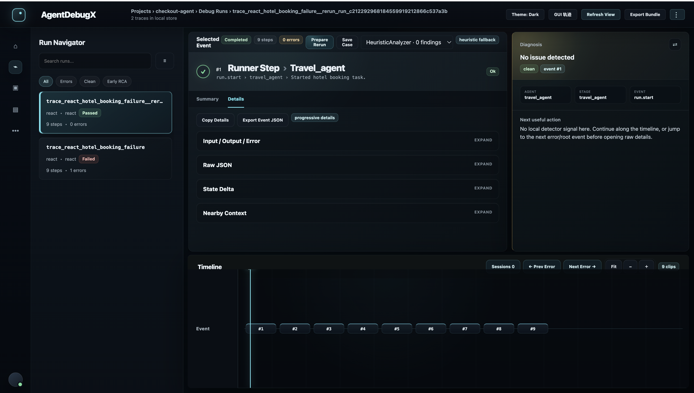

# Local inspection UI

The optional FastAPI application provides a local browser surface for stored traces and diagnostic reports.

## Install and launch

```bash
python -m pip install "agentdebugx[ui]"
```

Use a SQLite store:

```bash
agentdebug serve \
  --store-sqlite .agentdebug/traces.sqlite \
  --host 127.0.0.1 \
  --port 7777
```

Or a JSONL store:

```bash
agentdebug serve \
  --store-jsonl .agentdebug/traces.jsonl \
  --host 127.0.0.1 \
  --port 7777
```

Open [http://127.0.0.1:7777](http://127.0.0.1:7777).



## Import native JSON files

Place normalized trajectory and diagnostic-report JSON files under `.agentdebug/imports/`, then select **Sync imports** in the workspace. To use a different server-owned directory, set `AGENTDEBUG_IMPORT_DIR` before starting the server.

## Inspect GUI evidence

OSWorld trajectories with locally available screenshot artifacts open in the read-only **Visual** view. The **Trace / Visual** control switches representations without changing the selected event.

Visual compares:

- the selected action's explicit input image, or the preceding event result, and
- all result images attached to the selected event.

Screenshot files are served only through trace and event artifact IDs, and only when the resolved path remains inside the trajectory's recorded source directory.

## Discuss a report

**Discuss with Debugger** works with every normalized trace format. Discussions are local, reference canonical event IDs, and remain pinned to a report snapshot. They may create an exportable report-revision draft but never overwrite the stored diagnostic report.

## Prepare reruns

Rerun Composer opens from the selected event and uses it as the checkpoint. Configure runner details on the server:

```bash
export AGENTDEBUG_RUNNER_URL="http://127.0.0.1:8765"
```

The process compatibility fallback is:

```bash
export AGENTDEBUG_RERUN_COMMAND="python path/to/project_rerun_runner.py"
```

The browser does not accept or persist runner commands or bearer tokens.

!!! warning "Keep the default host local"

    Use `127.0.0.1` unless the application is placed behind appropriate authentication and transport security.
